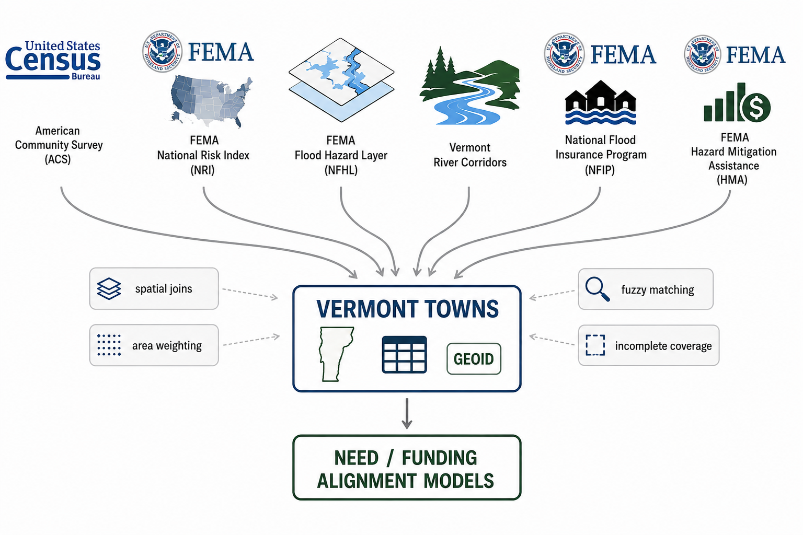
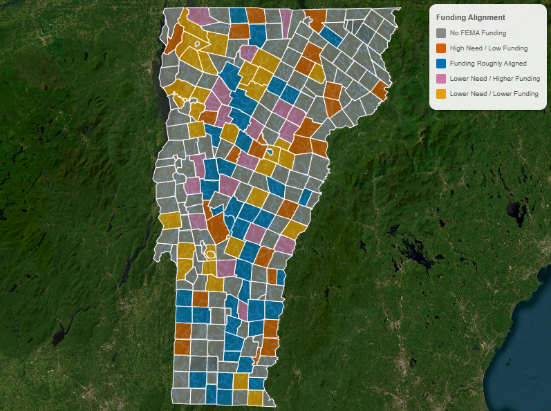
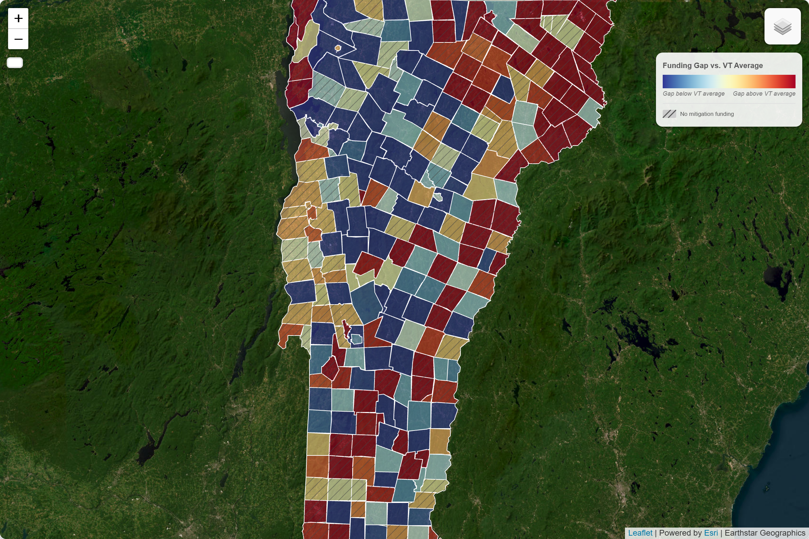
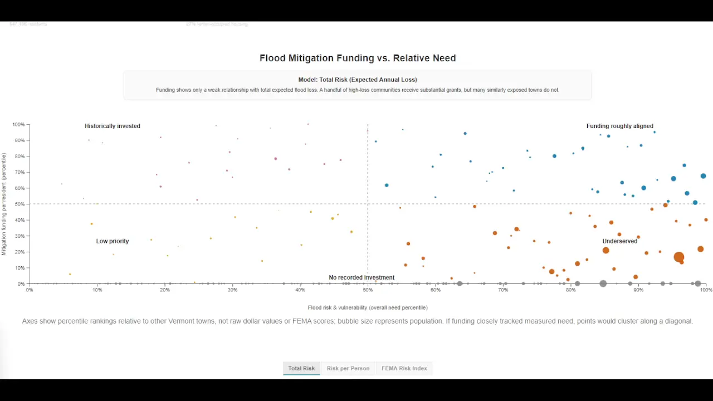

# Hazard Funding Comp

_Risk is not equally distributed. Neither is the money to address it — and neither is the effort to go get it._

A comparative analysis of FEMA hazard mitigation funding in **North Topsail Beach, North Carolina** against similarly situated coastal municipalities, built for eventual incorporation into the **Reef Advocate** project.

> **Attribution.** This repository is a derivative work of **[Floodlines](https://github.com/johbry17/Floodlines)** by **Bryan C. Johns**, used and adapted under the MIT License. The entire analytical framework, ETL pipeline, index methodology, and interactive dashboard are his work. See [Attribution & Upstream Project](#attribution--upstream-project) below.

> **Status.** A first North Carolina module is live at **`docs/nc/`** — an interactive map of every FEMA hazard mitigation award to the state's 21 Atlantic-facing barrier-island municipalities, built directly from the FEMA API. The inherited **Vermont** index pipeline (notebooks, `data/cleaned/`, `docs/index.html`) is untouched and still describes Vermont; the need/gap index has not yet been ported to NC.

## Table of Contents

- [The Question](#the-question)
- [Why This Framework](#why-this-framework)
- [Comparison Design](#comparison-design)
- [What This Data Can and Cannot Show](#what-this-data-can-and-cannot-show)
- [Roadmap](#roadmap)
- [Repository Structure](#repository-structure)
- [Usage](#usage)
- [Inherited Methodology](#inherited-methodology)
- [Gallery (Upstream Vermont Dashboard)](#gallery-upstream-vermont-dashboard)
- [Attribution & Upstream Project](#attribution--upstream-project)
- [References](#references)
- [License](#license)
- [Author](#author)

## The Question

FEMA's Hazard Mitigation Assistance programs — HMGP, BRIC/PDM, and Flood Mitigation Assistance — do not pay homeowners directly. Property owners cannot apply on their own. Funding flows through a **sub-applicant**, almost always the local government, which identifies candidate properties, assembles benefit-cost analyses, files the sub-application with the state emergency management agency, and administers the award.

That structure makes the municipality a gatekeeper. A town that actively solicits interest from flood-damaged homeowners, maintains a repetitive-loss list, and staffs grant administration will move federal mitigation dollars to its residents. A town that does none of those things will not, no matter how much its residents want elevation, acquisition, or reconstruction assistance.

This project asks whether **North Topsail Beach** has functioned as the second kind of town, by measuring its mitigation funding record against comparable North Carolina coastal municipalities facing similar hazard exposure.

## Why This Framework

Floodlines already solves the hard parts of this comparison. It builds a reproducible, defensible measure of how much mitigation funding a municipality *should* have pursued given its risk and its residents' vulnerability, then measures the distance between that and what it actually received:

- **Need index** — a rank-normalized composite of flood risk (FEMA Expected Annual Loss) and social vulnerability (poverty, age 65+, no vehicle access)
- **Funding gap** — need minus scaled funding, so positive values identify municipalities receiving less than their measured need would predict
- **Quadrant classification** — underserved / aligned / historically invested / low priority / no recorded investment
- **Sensitivity analysis** — leave-one-variable-out, weight perturbation, and normalization comparison, so a finding cannot be dismissed as an artifact of modeling choices

That last point matters most here. An adversarial reader will argue the ranking was constructed to produce the desired answer. The inherited sensitivity machinery is the response to that argument, and it should be run and reported, not skipped.

## Comparison Design

**Subject:** North Topsail Beach, Onslow County, NC.

**Candidate comparison towns — proposed, not yet determined.** North Carolina barrier-island and oceanfront municipalities with comparable exposure:

| Region | Candidates |
|--------|-----------|
| Topsail Island (same island, same inlet dynamics) | Surf City, Topsail Beach |
| Bogue Banks | Emerald Isle, Atlantic Beach, Pine Knoll Shores, Indian Beach |
| Brunswick County | Holden Beach, Ocean Isle Beach, Oak Island, Caswell Beach |
| New Hanover County | Carolina Beach, Kure Beach, Wrightsville Beach |
| Outer Banks | Nags Head, Kitty Hawk, Kill Devil Hills, Duck |

Comps should be matched on hazard exposure, housing stock, population and seasonal-population profile, and municipal fiscal capacity — not merely on being coastal. Two structural factors deserve explicit treatment before any comparison is drawn:

1. **Coastal Barrier Resources System (CBRS).** Substantial portions of North Topsail Beach lie within CBRS units, which restricts certain federal expenditures and new federal flood insurance availability. This can independently suppress a funding record. Verify current unit boundaries against the FWS CBRS mapper and either match comps on CBRS status or control for it explicitly.
2. **NFIP Community Rating System participation.** CRS class is a direct, public indicator of a municipality's investment in floodplain-management activity, and several candidate comps participate. It belongs in the comparison as an independent variable.

## What This Data Can and Cannot Show

The FEMA HMA dataset records **approved projects**. It does not record applications filed, applications denied, or assistance a town declined to offer. This is stated as a limitation in the upstream project, and the reframed question here depends on it more heavily than the original did.

**The quantitative pipeline can establish:** that North Topsail Beach's mitigation funding record diverges from peer municipalities with comparable risk and vulnerability, that the divergence is robust across model specifications, and its approximate magnitude in inflation-adjusted federal dollars.

**It cannot, by itself, establish:** that the divergence is caused by municipal inaction. A thin funding record is equally consistent with a town that applied and lost, a town whose residents never sought assistance, or a town constrained by CBRS designation.

Closing that gap requires records this pipeline does not contain:

- FEMA and NC Emergency Management sub-application records, including unsuccessful and withdrawn applications
- Town council minutes, budgets, and staffing records bearing on grant administration capacity
- NFIP repetitive-loss and severe-repetitive-loss property counts
- CRS participation history and class
- Public communications to homeowners about available mitigation programs

Public records requests to the Town of North Topsail Beach and to NCEM are the natural source. Keep the quantitative finding and the causal claim clearly separated in anything published from this repo.

## Quickstart

```bash
npm install     # one time — installs Puppeteer (map image export)
npm run build   # fetch FEMA + Census data, build the map payload
npm start       # serve at http://localhost:8000
```

Then open **http://localhost:8000/nc/** — the North Carolina comparison map.
(http://localhost:8000/ is the inherited Vermont dashboard.)

| Command | What it does |
|---|---|
| `npm run build` | Rebuild the NC map data from cached sources |
| `npm run build:refresh` | Re-download from FEMA + Census first, then rebuild |
| `npm start` | Serve `docs/` on port 8000 |
| `npm run export-maps` | Regenerate static map images (Vermont article) |

Only `npm run build` needs the network, and only Python 3 — no pip installs. The
Vermont notebook pipeline is separate and has its own dependencies (see [Usage](#usage)).

## The NC Comparison Map

**What it shows.** Every HMA award to the 21 NC oceanfront municipalities, 1989–2024. Click a town to drill in, shift-click to compare. Filter by program year range, program (HMGP / FMA / PDM / SRL), and project category. Any view is shareable — selection, year range, and metric round-trip through the URL.

**The metric that matters** is *homeowner-directed* funding: FEMA activity codes for acquisition, elevation, and reconstruction of **private structures**, separated from generators, utilities, planning, and other municipal-asset work. A town can post a respectable funding total without a dollar of it reaching a homeowner, and this view makes that visible.

**Coast-wide, all years:** $5.78M federal obligated, $24.0M in non-federal share, 65 awards across 18 of 21 towns. Duck, Pine Knoll Shores, and Indian Beach have no record at all.

**Data sources:** FEMA OpenFEMA HMA Projects v4 (bulk CSV) and Census TIGERweb incorporated places (GeoJSON). Both public, neither requiring a key. `docs/nc/data/unmatched.csv` is the audit trail for the subrecipient name-matching step.

## Roadmap

1. Finalize comparison towns and document the matching criteria
2. Resolve the unit of analysis — NC municipalities are Census **incorporated places** (7-digit GEOID), not the county subdivisions Vermont uses (10-digit GEOID); this propagates through every join in the pipeline
3. Port ETL notebooks `01`–`09` to NC sources; the national datasets (HMA, NFIP, NRI, NFHL, ACS, CPI) carry over unchanged, the Vermont ANR river-corridor layer does not and needs a coastal substitute
4. Add CBRS and CRS status as variables
5. Re-run index construction, sensitivity, and quadrant analysis on the NC comp set
6. Layer in the qualitative record from public records requests
7. Rebuild the dashboard and narrative for the comp set, then port into Reef Advocate

## Repository Structure

```
notebooks/     Numbered ETL → EDA → index → sensitivity → export pipeline
data/          raw/ source data, cleaned/ pipeline outputs, resources/ reference tables
docs/          Static dashboard + article, deployed via GitHub Pages
scripts/       Puppeteer map-image export utility
archive/       Unimplemented Postgres backend and overlay-refactor sketches
```

Each of `notebooks/`, `data/`, and `docs/static/js/` has its own README. Variable-level documentation lives in `data_dictionary_backend.md` and `data_dictionary_frontend.md`; methodology in `technical_summary.md`.

## Usage

**Run the analysis locally:**

```bash
pip install pandas geopandas numpy matplotlib seaborn scikit-learn scipy statsmodels esda libpysal jupyterlab
jupyter lab
```

Run notebooks in numeric order: `01`–`06` (source ETL) → `09` (merge) → `10`–`13` (EDA) → `20` (index) → `21` (sensitivity) → `22` (quadrants) → `29` (web export).

**Serve the dashboard locally** (must be over HTTP — the app fetches CSV and GeoJSON):

```bash
python -m http.server 8000 --directory docs
```

**Regenerate static map images:**

```bash
npm install && node scripts/export_maps.js
```

## Inherited Methodology

Summarized from the upstream project; full detail in `technical_summary.md`.

**Index construction.** The need index combines a flood-risk component (FEMA Expected Annual Loss) and a social-vulnerability component (poverty rate, percent elderly, percent households without a vehicle), each percentile-normalized across all municipalities and weighted 50/50. The gap index is need minus scaled funding.

**Normalization.** Rank-based rather than z-score — robust to the extreme outliers typical of flood data, bounded [0,1] and interpretable to non-technical audiences, comparable across incompatible units, and confirmed by sensitivity analysis to leave substantive findings stable (need-index Spearman between methods: 0.89–1.00).

**Model specifications.** Three carried into the dashboard: `core_EAL_model` (primary), `eal_per_capita_model` (robustness), and `fema_national_risk_index` (external benchmark). Claims-based need models were excluded as circular — their high need–funding correlation reflects the reactive allocation pattern being measured, not independent signal. Expanded vulnerability specifications were excluded for failing parsimony without improving predictive performance.

**Funding.** All HMA amounts inflation-adjusted to 2025 dollars via CPI-U. Only approved projects localizable to a specific municipality are counted; county, regional, and statewide projects and planning/administrative costs are excluded. Amounts reflect the federal share obligated.

**NFIP.** Claims reflect insured losses only, so they understate true flood exposure wherever policy penetration is low.

## Gallery (Upstream Vermont Dashboard)

These images show the **Vermont** analysis as built by Bryan Johns — included to illustrate what the framework produces, not as results for North Carolina.


_Data sources and analytical workflow. Federal hazard, insurance, demographic, and mitigation datasets integrated at the municipal level. Illustration: AI-generated._


_Municipalities classified as underserved, historically invested, aligned, low priority, or no recorded investment._


_The need index: a rank-based composite of flood exposure and social vulnerability._


_Where need substantially exceeds FEMA HMA investment._


_Weak alignment between structural need and federal mitigation dollars, across alternative definitions of need._


_Per-municipality statistics, percentile rankings, and quadrant classification._

## Attribution & Upstream Project

**Floodlines** — © 2026 Bryan C. Johns, MIT License.
🔗 [Repository](https://github.com/johbry17/Floodlines) · [Live Dashboard](https://johbry17.github.io/Floodlines/) · [Analysis Article](https://johbry17.github.io/Floodlines/article.html)

Floodlines asked whether FEMA mitigation funding aligns with flood risk and community need across Vermont's 250+ towns, following Hurricane Irene (2011) and the 2023 floods. Its findings:

- More than half of Vermont municipalities received no FEMA Hazard Mitigation Assistance funding
- Funding shows only weak alignment with forward-looking measures of flood risk and vulnerability
- Funding is more strongly associated with past insured losses than with modeled future risk
- The pattern persists across multiple risk models, normalization methods, and sensitivity tests

The framing that funding follows institutional memory of past disasters rather than modeled future risk is Bryan Johns's, as is every line of the pipeline and dashboard this repository builds on. This project applies his framework to a narrower question in a different state; any errors introduced in that adaptation are ours.

Upstream acknowledgements, preserved: the Vermont Agency of Natural Resources, FEMA, and the U.S. Census Bureau for public data, and the open-source geospatial community — GeoPandas, libpysal, Leaflet, D3, and OpenStreetMap.

**Tools & technologies** (inherited): JavaScript, Leaflet.js, D3.js, HTML/CSS · Python, Pandas, GeoPandas, NumPy, Jupyter · Shapely, libpysal, ESDA · scikit-learn, scipy, statsmodels · GitHub Pages.

## References

National sources — carry over to the North Carolina adaptation:

- [OpenFEMA: Hazard Mitigation Assistance Projects](https://www.fema.gov/openfema-data-page/hazard-mitigation-assistance-projects-v4) — mitigation funding and project allocation by municipality
- [FEMA Mitigation eGrants Guide to Eligible Activities and Codes](https://www.fema.gov/sites/default/files/2020-08/fema_mt-egrants-guide-to-eligible-activities-and-codes_job_aid_March_2018.pdf) — project type classification
- [OpenFEMA: NFIP Redacted Claims](https://www.fema.gov/openfema-data-page/fima-nfip-redacted-claims-v2) — municipal flood insurance claims
- [OpenFEMA: NFIP Redacted Policies](https://www.fema.gov/openfema-data-page/fima-nfip-redacted-policies-v2) — policy counts and insurance penetration
- [FEMA National Risk Index](https://www.fema.gov/about/openfema/data-sets/national-risk-index-data) — expected annual loss, social vulnerability, community resilience
- [National Flood Hazard Layer (NFHL)](https://hazards.fema.gov/femaportal/NFHL/searchResult/) — flood zone boundaries
- [U.S. Census: American Community Survey](https://data.census.gov/) — demographic, housing, and socioeconomic variables
- [U.S. Census TIGER/Line Shapefiles](https://www2.census.gov/geo/tiger/) — municipal boundaries and spatial joins (NC adaptation needs `PLACE`, not `COUSUB`)
- [FRED: CPI-U, U.S. City Average](https://fred.stlouisfed.org/series/CPIAUCSL) — inflation adjustment to constant dollars
- [UnitedStatesZipCodes.org ZIP Code Database](https://www.unitedstateszipcodes.org/zip-code-database/) — ZIP crosswalk for policies with missing community names

Vermont-specific, replaced in the North Carolina adaptation:

- [Vermont ANR River Corridors](https://www.arcgis.com/home/item.html?id=51797aa9327343b9a04215e5e59e00c5) — no NC analog; coastal substitutes needed
- Vermont Center for Geographic Information boundaries — state reference boundaries

To be added for North Carolina:

- U.S. Fish & Wildlife Service Coastal Barrier Resources System mapper — CBRS unit boundaries
- FEMA Community Rating System eligible communities list — CRS class by municipality
- NC Emergency Management hazard mitigation program records

## License

MIT License. Original work © 2026 Bryan C. Johns; adaptations © 2026 Jake Durell. See [LICENSE](LICENSE) — the upstream copyright notice is retained as the license requires.

## Author

Adaptation by Jake Durell, [JOD Law](mailto:jdurell@jod-law.com), 2026.
Original framework by [Bryan Johns](https://github.com/johbry17) — [bryan.johns@informedwanderer.com](mailto:bryan.johns@informedwanderer.com) · [LinkedIn](https://www.linkedin.com/in/b-johns/) · [Portfolio](https://informedwanderer.com)
