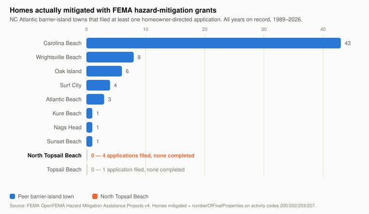
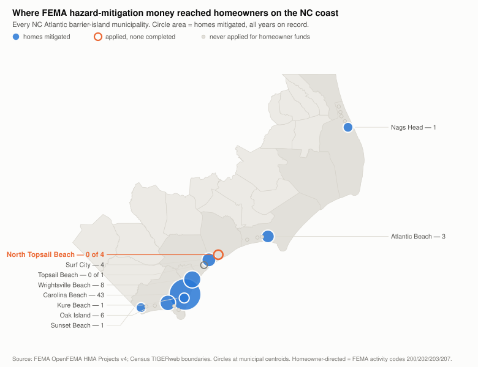

# Hazard Mitigation Assistance and North Topsail Beach

## 1. The headline

Over the full FEMA record (1989–2026), North Topsail Beach has filed **four** homeowner‑directed hazard mitigation applications — acquisition, elevation, or reconstruction of privately owned structures.

**Homes actually mitigated: zero.**

Three of those four were not rejected. FEMA reviewed them, scored them as cost‑effective, and **obligated money against them:**

| Award | Program | Storm | Activity | Initial obligation | FEMA benefit‑cost ratio | Homes in scope | Homes completed | Final federal share |
|---|---|---|---|---|---|---|---|---|
| DR‑4019‑0014‑R | HMGP | Irene (2011) | Elevation, private structures – coastal | $115,538 | **7.48** | 1 | **0** | $0 |
| DR‑4393‑0027‑R | HMGP | Florence (2018) | Acquisition, private real property | $282,913 | **1.50** | 2 | **0** | $0 |
| DR‑4393‑0097‑R | HMGP | Florence (2018) | Mitigation reconstruction | $156,494 | **1.09** | 1 | **0** | $0 |
| | | | **Total** | **$554,946** | | **4** | **0** | **$0** |

A benefit‑cost ratio above 1.0 is FEMA's eligibility threshold. All three cleared it — one by more than seven times. Every one of them closed with no property completed and no federal share retained.

---

## 2. How that compares to the peer group

Among all 21 North Carolina Atlantic barrier‑island municipalities, North Topsail Beach is the only town that filed **three or more** homeowner‑directed applications and completed **none**. Carolina Beach — one island system south, on the same coast, under the same state emergency management agency — completed **43 homes** and retained **$2.86 million** in federal share.

The comparison is closer than geography alone. Since the 2021 update, these towns have planned under **the same document**: the Southeastern North Carolina Regional Hazard Mitigation Plan covers Brunswick, New Hanover, Onslow and Pender counties and their municipalities, so North Topsail Beach, Carolina Beach, Wrightsville Beach, Kure Beach, Oak Island, Holden Beach, Ocean Isle Beach, Sunset Beach, Bald Head Island, Surf City and Topsail Beach now share one regional plan, one planning process, and one state emergency management partner. Whatever separates their records, it is not the planning framework.

---

## 3. This does not depend on a hurricane, and it never did

This is the point on which the record is clearest, and it is worth stating precisely because it is easy to get backwards.

**Most of this money is not disaster‑triggered.** Of the 65 hazard mitigation filings by NC barrier‑island towns, **31 carry no disaster number at all.** They come from the competitive programs — Flood Mitigation Assistance (FMA), PDM, and BRIC — which open on an annual cycle regardless of whether a storm hit. Statewide, FMA alone has put **$5.34 million** into **122 homes** across **18 NC communities**. Carolina Beach's record is built almost entirely on FMA, not on disaster money.

**Even the disaster‑triggered program does not require a local hit.** HMGP is allocated to the *state* off a declaration; the State administers it and may fund projects anywhere in North Carolina, whether or not a given county was among the areas designated for individual or public assistance. The Town's own plan relies on exactly that. Action ES6‑1 records "**HMGP 4827 project scheduled for 2026‑27**" — and DR‑4827 is Tropical Storm Helene, whose 40 designated areas are all western and piedmont counties. **Onslow is not among them.**

Nothing about this is irregular; it is simply how HMGP works, and the Town is right to pursue those funds. But it disposes of the idea that mitigation here had to wait for a storm to hit Onslow County. The Town is already programming Helene money. What has never been programmed is the homeowner side.

---

## 4. What the Town's own 2026 plan shows

The **North Topsail Beach Mitigation Action Plan 2026** — the Town's jurisdiction‑specific action annex to the Southeastern North Carolina Regional Hazard Mitigation Plan — is the clearest document in this file, because the Town wrote it. It is **adopted, not pending**: the Board of Aldermen adopted the regional plan on March 4, 2026 and FEMA approved it on April 21, 2026.

**To be clear at the outset: the draft plan does contain potential, to be determined, homeowner actions.** Actions PP1, PP2 and PP3 cover relocation, acquisition and elevation of private homes. They are prospective — the plan's own language is "*by applying for*" HMGP funding "*when available after a major disaster has been declared*," scheduled 2026–2031 — so they are statements of intent to apply rather than projects underway. Their presence is still a genuine step forward and should be recognized as one.

The problem is not that they are absent. It is *how the plan treats them* compared to the shoreline work the Town has actually delivered. Both tracks sit in the same document, under the same column headings, and the plan fills those columns in very differently.

| What the plan records | **Shoreline / dune work** (NR8‑2 … NR8‑6) | **Homeowner property protection** (PP1, PP2, PP3) |
|---|---|---|
| Relative priority | **High** | Medium |
| Lead agency / department | **Town Manager** | Planning Department |
| Potential funding sources | **"75% FEMA; 25% State"** (one at 100% State) | **"Local"** |
| Precondition | none stated — programmed and executed | *"when available after a major disaster has been declared by the President"* |
| Implementation schedule | dated: Spring 2021, Winter 2021, Spring 2022, 2022–2024, 2023–2025 | "2026–2031" — an open six‑year window |
| Implementation status | **COMPLETED — five projects** | **"NEW ACTION in 2026"** |
| Delivered to date | 5 shoreline projects, at zero net cost to the Town | 0 homes |

Read across the "Potential Funding Sources" row. For dunes, the Town named the federal cost share. For homes, the Town wrote **"Local"** — even though the description of all three actions is *apply for HMGP funding*. The plan describes a federal program and then books it as a local expense.

Three things follow, and each is checkable against the draft:

1. **"NEW ACTION in 2026" is the plan's own label, and it means these actions were not in the prior plan.** The 2026 draft is a substantial rewrite — 18 of its 47 actions carry that label, so being new is not by itself unusual. What matters is *which* actions were missing: through the whole period in which the Town programmed and completed five shoreline projects, its mitigation plan carried **no standing action for homeowner acquisition, elevation, or relocation at all.** The Town is proposing in 2026 to begin doing what Carolina Beach has been doing since 1999.
2. **An action in a mitigation plan is an intention, not a project — and its absence never barred one.** Listing an action carries no application, no filing window, and no money; the NR8 rows have completion dates and cost shares because those became real projects, while PP1–PP3 have a six‑year window and "Local." The converse matters just as much: the Town did not need PP1–PP3 on the list in order to file for homeowner mitigation in 2011, 2018, or any year in between. See §5.
3. **The plan never mentions FMA or BRIC.** Not once, anywhere in the document. The two annual, non‑disaster programs that produced most of the homeowner mitigation on this coast — and nearly all of Carolina Beach's 43 homes — do not appear as potential funding sources for property protection. That omission is what makes the disaster‑gate language in PP1–PP3 self‑fulfilling: if HMGP is the only listed vehicle, then homeowner mitigation really does have to wait for a declaration.

**Because the plan is now adopted, this cuts in favor of both the Town and NTB homeowners.** PP1, PP2 and PP3 are no longer proposals. They are adopted commitments in a FEMA‑approved mitigation plan, carrying the Town's own priority ranking and its own lead department. The operative question is therefore no longer whether the Town will pursue homeowner mitigation — it has committed to doing so — but **when it will file, and under which program.**

Adding FMA and BRIC to the funding‑source column for PP1–PP3 is now a plan amendment rather than a comment on a draft. That is a routine administrative step, it costs the Town nothing, and it removes the one feature of the adopted text that makes the commitment self‑defeating: naming HMGP as the sole vehicle guarantees the disaster‑gate language does all the work.

---

## 5. Eligibility is not the obstacle — and the record proves it

The coastal barrier designation is the explanation most likely to be offered for the Town's record. It does not survive contact with the file.

**North end properties like Topsail Reef carry NFIP flood insurance.** Flood Mitigation Assistance requires that the property carry a flood insurance policy in force under the National Flood Insurance Program. The eight Topsail Reef oceanfront buildings are covered, and likely neighboring properies outside of CBRA as well. **The FMA insurance prerequisite is satisfied today** — without the Town doing anything, and without waiting for a storm.

**FEMA has already obligated money against homes in this town — three times.** Whatever the Coastal Barrier Resources Act (16 U.S.C. § 3501 *et seq.*) does or does not restrict, it did not stop FEMA from obligating **$554,946** against three North Topsail Beach homeowner projects between 2013 and 2022, each with a computed benefit‑cost ratio above 1.0. FEMA does not obligate funds against ineligible projects. Eligibility was resolved in the Town's favor three separate times, and all three still closed with zero homes completed. **The barrier designation cannot explain an outcome that occurred after FEMA had already said yes.**

**Nor was the mitigation plan itself ever the obstacle.** A FEMA‑approved local hazard mitigation plan is a condition of receiving HMA project funds (44 C.F.R. § 201.6(a)(1)). But the condition is that the **plan** be approved and current — not that the particular project already appear on the plan's action list. North Topsail Beach necessarily met that condition throughout the relevant period: FEMA obligated funds to the Town in **2013, 2016, 2021 and 2022**, which could not have occurred had the Town lacked an approved plan. Coverage is also current today — FEMA approved the regional plan on April 21, 2026, for the standard five‑year term. The Town had plan coverage the entire time, and has it now. What it did not have was a filed and completed homeowner application.

Two consequences follow, and they point in the same direction. The absence of PP1–PP3 from earlier plans **did not bar the Town from applying** for homeowner mitigation in any of those years. And adding PP1–PP3 in 2026 **is not itself an application** — it creates no authority the Town lacked and substitutes for nothing. *(State ranking criteria may award points for projects identified in the local plan, which is a good reason to list them. It is not a reason the Town could not have applied without them.)*

**Two distinct mechanisms are routinely conflated, and they should not be.** CBRA generally bars new federal expenditures and financial assistance within CBRS System Units, subject to statutory exceptions. Separately, structures built or substantially improved after a unit's designation date are ineligible for federal flood insurance; structures predating designation remain insurable, which is why NFIP coverage exists across this island. A property's insurance status and a project's expenditure eligibility are different questions with different answers, and "CBRA" is not a single yes‑or‑no.

### Why this matters to the Town's own legislative ask

The Town is asking the federal delegation to reduce the coastal barrier designation covering parts of North Topsail Beach. That effort deserves support. It is raised here because the Town's mitigation record is a weakness in its own case — and one the Town can still fix before the ask is evaluated.

A congressional office evaluating a request to reduce a CBRS designation will ask the obvious question: **what has the Town done to reduce risk with the authorities it already has, in the areas where nothing restricts it?** As of today the answer in the federal record is zero completed homeowner mitigation projects, town‑wide, over thirty years — including three that FEMA had already funded.

That is a difficult record to take to Congress while asking for expanded federal exposure. It is a much stronger record if, in the interim, the Town has sponsored FMA applications for NFIP‑insured oceanfront structures and can show completed mitigation. **The interests here align.** The fastest way for the Town to strengthen its legislative position is to build the mitigation record it currently lacks, and the Phase 1 oceanfront — insured, exposed, and eligible — is where it can start.

---

## 6. Cost to the Town

Hazard mitigation assistance is cost‑shared, typically **75% federal**, with the balance frequently covered by the State or by the participating property owner. Of North Carolina's homeowner‑directed awards on record, most run at 75% federal; 23 run at 90% and 25 run at **100% federal**.

The Town has already demonstrated it can access this structure at no local cost — five times, for dunes, at 75% FEMA / 25% State or 100% State. Nothing in the program requires the Town to fund the homeowner side either. **The Town's role is sponsorship and administration, not payment.** A municipality must be the applicant; individual homeowners cannot apply directly. That is the entire ask.

---

## 7. About the data

FEMA's Hazard Mitigation Assistance file records **approved projects only** — not applications a town considered and never filed, not applications denied before award, and not assistance a town declined to offer.

Every figure here comes from public datasets cited below, it is compiled here using AI assistance, and should be verified against them before being relied on.

---

## 8. Sources

- FEMA OpenFEMA, *Hazard Mitigation Assistance Projects v4* — `fema.gov/api/open/v4/HazardMitigationAssistanceProjects`
- FEMA OpenFEMA, *Disaster Declarations Summaries v2* — designated‑area join for DR‑1240, DR‑4019, DR‑4393, DR‑4827
- U.S. Census Bureau TIGERweb — incorporated place and county boundaries
- Town of North Topsail Beach, *Mitigation Action Plan 2026 (DRAFT)*, Planning Board 12/11/2025 — actions P1–P8, PP1–PP6, NR6–NR10, ES1–ES6
- Homeowner‑directed defined as FEMA activity codes **200** (acquisition), **202** (elevation), **203**, and **207** (mitigation reconstruction) of private structures
